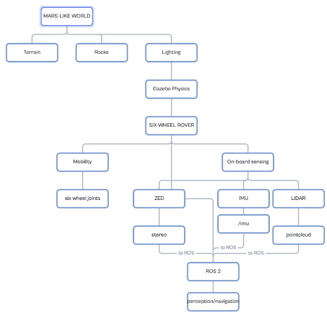
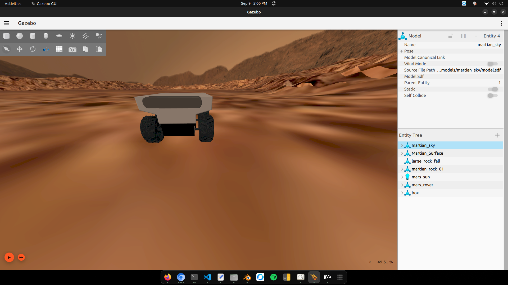
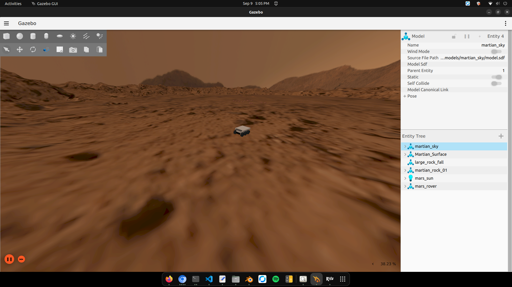
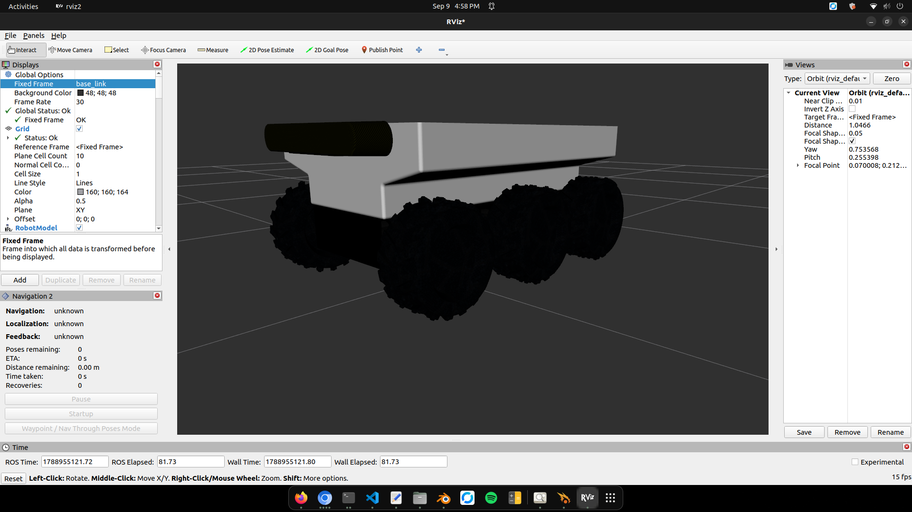
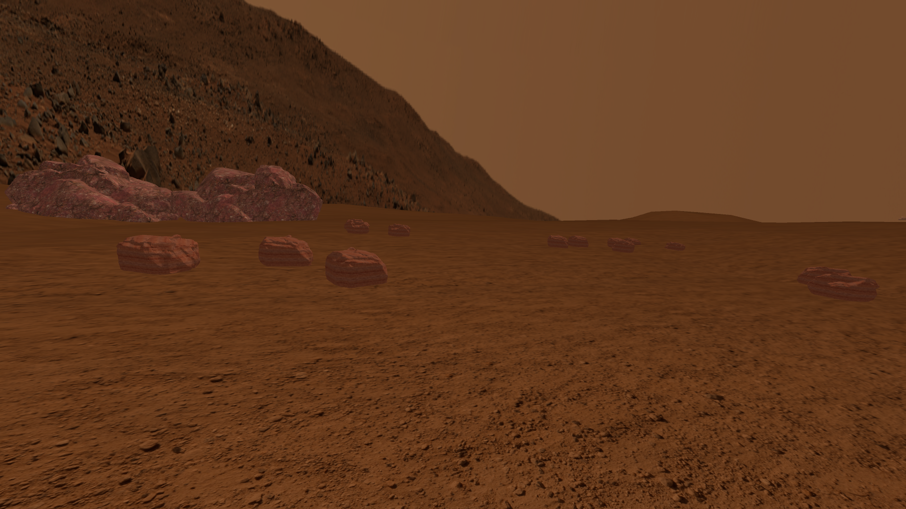
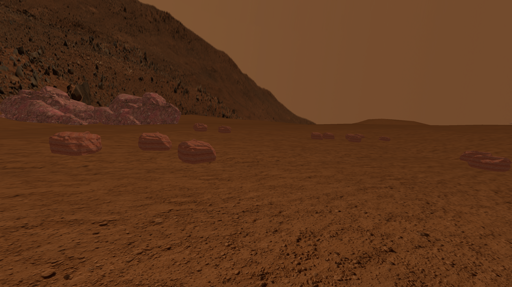
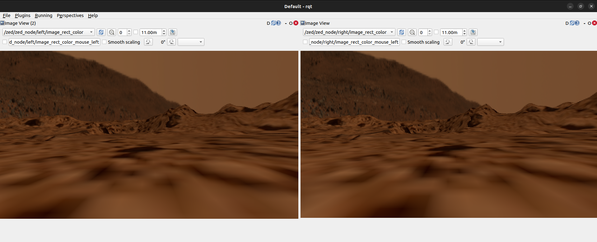

# Mars Rover Simulation and Evaluation Framework

ROS 2 and Ignition Gazebo simulation framework for evaluating a six-wheeled rover in a Mars-inspired, physically interactive environment.

The platform integrates rover mobility, heterogeneous terrain, stereo vision, inertial sensing, and 3D LiDAR within a common ROS 2 simulation architecture.

## Research Context

The rover is treated as both a mobility platform and a mobile sensing element for Mars-analog surface-operation studies, including inspection, monitoring, route assessment, environmental observation, and navigation-related research.

## Project Overview

The simulation combines:

- A six-wheeled rover model
- Explicit continuous wheel joints
- Rover mass and inertial properties
- Separate visual and collision representations
- A Mars-inspired heterogeneous terrain
- Mars gravity of approximately 3.73 m/s²
- Rocks and boulders
- A ZED 2i-style stereo camera
- An IMU
- A RoboSense-style 16-channel 3D LiDAR
- ROS 2 and Ignition Gazebo integration
- RViz visualization
- `/cmd_vel` teleoperation

## Simulation Overview



The overall workflow is:

ROS 2 -> Ignition Gazebo -> rover mobility and sensors -> ROS 2 topics/TF -> RViz and downstream perception/navigation.

## Rover in Gazebo

The rover is simulated as a physically interactive six-wheel platform. The wheel assemblies use explicit continuous joints while the motor/axle components are fixed relative to the rover body.



## Mars-Analog Environment

The environment uses heterogeneous terrain appearance, uneven terrain geometry, rocks/boulders, Mars-inspired lighting, and reduced gravity.

The environment is Mars-inspired and informed by characteristics associated with Martian rover exploration, particularly the Perseverance exploration environment at Jezero Crater. It is not intended to be an exact metric reconstruction of Jezero Crater.



## Rover in RViz

RViz provides visualization of the rover TF structure, robot model, and sensor-related data.



## ZED 2i-Style Stereo Camera

The rover contains separate left and right camera frames representing a stereo configuration.

ROS topics:

`/zed/zed_node/left/image_rect_color`

`/zed/zed_node/right/image_rect_color`

## Stereo Camera

### Left Camera



### Right Camera



The repository documentation uses one combined screenshot from the ROS image visualization interface to show both stereo views.



## Main ROS 2 Topics

### Motion

`/cmd_vel`

`/joint_states`

### Stereo Camera

`/zed/zed_node/left/image_rect_color`

`/zed/zed_node/right/image_rect_color`

### IMU

`/imu/data`

### LiDAR

`/robosense/points`

### TF

`/tf`

`/tf_static`

### Robot Description

`/robot_description`

## LiDAR Configuration

The simulated RoboSense-style LiDAR is configured as a 16-channel three-dimensional sensor.

Configuration:

- 16 vertical channels
- 720 horizontal samples
- 360° horizontal field of view
- approximately ±15° vertical field of view
- nominal update rate of 5 Hz
- PointCloud2 output
- XYZ, intensity, and ring fields

Validated ROS topic:

`/robosense/points`

Validation commands:

```bash
ros2 topic hz /robosense/points
ros2 topic echo /robosense/points --once
ros2 topic info /robosense/points -v
```

A validated run produced approximately 4.6–4.9 Hz under the tested simulation workload.

## IMU Configuration

The simulated IMU is mounted on the rover body and publishes:

`/imu/data`

Validation commands:

```bash
ros2 topic hz /imu/data
ros2 topic echo /imu/data --once
```

A stationary validation run produced a vertical acceleration response consistent with the configured Mars gravity of approximately 3.73 m/s².

## Software Stack

- Ubuntu Linux
- ROS 2 Humble
- Ignition Gazebo Fortress
- RViz 2
- ros_gz_bridge
- URDF/Xacro
- SDF 1.9

## Workspace Structure

```text
mars_exploration_ws/
├── src/
│   ├── mars_rover/
│   │   ├── launch/
│   │   ├── urdf/
│   │   ├── meshes/
│   │   └── ...
│   ├── red_planet/
│   │   ├── worlds/
│   │   └── models/
│   └── mars_gz/
│       └── models/
├── media/
│   ├── architecture.png
│   ├── rover/
│   │   ├── gazebo_rover.png
│   │   └── rviz_rover.png
│   ├── environment/
│   │   └── mars_environment.png
│   └── stereo_camera/
│       └── zed_stereo_rqt.png
├── docs/
├── README.md
├── CITATION.cff
├── COPYRIGHT.md
├── ASSET_LICENSES.md
├── CHANGELOG.md
└── .gitignore
```

## Build

```bash
source /opt/ros/humble/setup.bash
cd ~/mars_exploration_ws
colcon build --symlink-install
source install/setup.bash
```

## Run the Simulation

```bash
ros2 launch mars_rover gazebo.launch.py
```

The launch process starts the Gazebo environment, robot state publisher, joint state publisher, ROS-Gazebo bridges, RViz, and delayed rover spawning.

## Teleoperation

The rover accepts velocity commands through:

`/cmd_vel`

The command interface is bridged between ROS 2 and Gazebo.

A typical geometry message can be published with:

```bash
ros2 topic pub /cmd_vel geometry_msgs/msg/Twist "{linear: {x: 0.2, y: 0.0, z: 0.0}, angular: {x: 0.0, y: 0.0, z: 0.0}}"
```

Stop the rover with:

```bash
ros2 topic pub --once /cmd_vel geometry_msgs/msg/Twist "{linear: {x: 0.0, y: 0.0, z: 0.0}, angular: {x: 0.0, y: 0.0, z: 0.0}}"
```

## RViz

Recommended fixed frame:

`base_link`

For LiDAR visualization, add a `PointCloud2` display and select:

`/robosense/points`

The LiDAR cloud uses the `lidar_link` sensor frame.

## Validation Summary

### Rover

- Rover successfully spawns in Gazebo
- Six wheel joints are present
- Wheel rotation has been validated
- `/cmd_vel` teleoperation has been validated
- Rover TF structure is generated

### Mars Physics

Configured gravity:

`3.73 m/s²`

### IMU

Topic:

`/imu/data`

Observed stationary response:

`linear_acceleration.z ≈ 3.73 m/s²`

Observed output rate in a tested run:

`approximately 23–24 Hz`

### Stereo Camera

Topics:

`/zed/zed_node/left/image_rect_color`

`/zed/zed_node/right/image_rect_color`

Observed rates in tested runs:

`approximately 15–17 Hz under simulation load`

### LiDAR

Topic:

`/robosense/points`

Type:

`sensor_msgs/msg/PointCloud2`

Cloud structure:

`height: 16`

`width: 720`

Fields:

`x, y, z, intensity, ring`

Observed validated rate:

`approximately 4.6–4.9 Hz`

## Research Evaluation

The framework supports controlled variation of:

- gravitational acceleration
- surface friction
- rover mass properties
- terrain configuration
- obstacle distribution
- sensing configuration

Candidate measurements include:

- displacement
- travel time
- linear velocity
- wheel angular velocity
- pitch and roll
- IMU acceleration
- IMU angular velocity
- LiDAR output rate
- point-cloud observations
- camera output rate

A representative operational context is infrastructure inspection or surface monitoring, where the rover acts as a mobile sensing element while traversing a Mars-analog environment.

## Mars Terrain and Materials

The environment uses heterogeneous terrain appearance rather than a uniform red surface.

The terrain representation separates detailed visual geometry from a dedicated collision representation in order to balance visual fidelity and physics performance.

The visual environment can include Mars-inspired surface color, roughness, and surface-detail information together with independently modeled rocks and boulders.

These visual characteristics are intended to support a plausible Mars-analog simulation appearance and perception environment. They should not be interpreted as exact mineralogical or spectroscopic measurements of the Martian surface.

## Reproducibility

Generated ROS 2 directories such as:

`build/`

`install/`

`log/`

are intentionally excluded from version control.

The source repository contains the simulation packages, launch/configuration files, documentation, and permitted project assets required to reproduce the core simulation.

## Limitations

This repository does not claim:

- exact geological reconstruction of Jezero Crater
- exact Martian mineral spectral properties
- exact Martian illumination
- exact calibration of physical laboratory sensors
- direct validation of rover dynamics on Mars
- proof of long-duration autonomous Mars operation

The rover, terrain, and sensor configurations are engineering approximations intended for simulation-based research.

## Third-Party Assets

Some meshes, textures, materials, and other visual assets may originate from external sources.

See:

`ASSET_LICENSES.md`

and

`COPYRIGHT.md`

before redistributing or reusing project assets.

## Citation

See `CITATION.cff` for citation information.

## Research Documentation

Additional technical documentation is available in:

`docs/architecture.md`

`docs/simulation_validation.md`

`docs/research_notes.md`

## Acknowledgement

This repository supports research into planetary robotics, mobile sensing, Mars-analog simulation, and sustainable space-surface operations.
